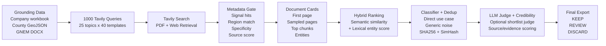

# Tavily Web Crawler Poster Guide

Scope note:
This guide is based on the Tavily crawler and GNEM filtering code under `tavily_ev_automation/`, the root documentation files, and `scripts/`. The `evAutomationUpdated/` folder was intentionally excluded from the poster content.

## Recommended Poster Story

Use one clear message at the top of the poster:

> I built a domain-grounded Tavily web-crawling and document-curation pipeline that retrieves EV battery supply-chain documents, filters them with multi-stage relevance and credibility scoring, removes duplicates, and exports a human-review-ready research corpus.

Best poster framing:

- This is not just a crawler.
- It is a research corpus construction and filtering workflow for Georgia and Southeast EV battery supply-chain intelligence.
- The main research pipeline is `gnem_pipeline.py`.
- The simpler `tavily_crawler.py` script is only a one-query helper and should not be presented as the full methodology.

## Suggested Poster Layout

Use a clean 3-column poster layout.

| Column | What to show | Best visual |
|---|---|---|
| Left | Research objective, input data, query generation | Small grounding-data graphic + query template examples |
| Middle | Main crawler and filtering workflow | One large horizontal pipeline diagram |
| Right | Scoring logic, deduplication, outputs, limitations | One compact equation box + one output table |

Suggested title:
`Domain-Grounded Tavily Web Crawling and Multi-Stage Document Filtering for EV Battery Supply-Chain Corpus Construction`

Suggested color style:

- Use dark navy for pipeline stage headers.
- Use green for `keep`, amber for `review`, and gray/red for `discard`.
- Use one accent color, such as teal, for all "grounding" concepts.
- Keep all method boxes the same size and align them in one left-to-right flow.

## Poster-Ready Methods Summary

You can paste this directly into a "Methods" box:

> The pipeline starts from GNEM grounding files containing Georgia EV companies, counties, OEMs, ports, and supply-chain concepts. These assets are converted into 1000 domain-specific Tavily search queries using 25 grounded topics and 40 query templates per topic. Tavily retrieves candidate web pages and PDFs, and each result is assigned a stable candidate ID, normalized URL, and metadata relevance score. Candidates that pass metadata and rule gates are either resolved from local storage or downloaded. The system then builds lightweight document cards from extracted text, first-page and sampled-page summaries, headings, top chunks, and grounded entities such as companies, counties, facilities, capacities, and dates. Documents are ranked with a hybrid score that combines semantic similarity to the GNEM use case and exact lexical/entity matches. A weakly supervised classifier estimates whether each document is direct supply-chain evidence, adjacent background, research-only material, generic news, or marketing noise. Shortlisted documents are reprocessed into enriched cards, exact and near duplicates are removed, an optional LLM judge can score the shortlist, credibility is assessed separately, a diversity pass prevents over-concentration in one subtopic, and the final output is exported as `keep`, `review`, or `discard` with audit-ready evidence and registry files.

## Main Workflow Figure

Use this as the central pipeline diagram on the poster.

```mermaid
flowchart LR
    A[GNEM grounding files\nCompanies, counties, OEMs,\nports, supply-chain terms]
    B[Grounded query generation\n25 topics x 40 templates\n= 1000 queries]
    C[Tavily retrieval\nPDF-only, web-only,\nor hybrid search]
    D[Stage 1 metadata scoring\nURL canonicalization\nand early dedupe]
    E[Stage 2 acquisition\nReuse local files\nor download documents]
    F[Stage 3 lightweight document cards\nFirst page, first two pages,\nsampled pages, headings, entities]
    G[Stage 4 hybrid scoring\nHeuristic + semantic similarity\n+ lexical entity evidence]
    H[Stage 5 classifier reranking\nDirect use case vs\nnoise/background classes]
    I[Stage 6 enriched cards\nTop chunks from anywhere\nin the document]
    J[Exact and near duplicate filtering\nSHA256 + SimHash]
    K[Stage 7 optional LLM judge\nJSON decision on shortlist]
    L[Stage 8 credibility + diversity\nSource trust, evidence depth,\nsubtopic balancing]
    M[Final corpus export\nkeep / review / discard\nreview workbook + registries]

    A --> B --> C --> D --> E --> F --> G --> H --> I --> J --> K --> L --> M
```



If Mermaid is not convenient in your poster software, redraw this as one left-to-right arrow diagram with 6 to 8 boxes and keep the wording short.

## Compact Stage Table For Poster

This table is short enough for one poster panel.

| Stage | What the code does | Why it matters |
|---|---|---|
| Grounding | Loads company names, counties, OEMs, port names, facility types, product terms, and a GNEM reference text from local assets. | Makes retrieval and scoring domain-specific instead of generic web search. |
| Query generation | Builds 25 topic seeds and applies 40 query templates to produce exactly 1000 unique GNEM-focused search queries. | Expands coverage across facilities, supplier tiers, logistics, policy, and risk. |
| Tavily search | Runs live Tavily search with `pdf_only`, `web_only`, or `hybrid` query variants and optional query enhancement. | Collects broad candidate documents while preserving the original query context. |
| Metadata scoring | Scores title/snippet/query/URL text using digital-twin signals, EV value-chain terms, Georgia/Southeast anchors, specificity, source credibility, and noise penalties. | Rejects weak candidates before expensive parsing and downloading. |
| Acquisition | Reuses local documents when available; otherwise downloads PDFs/HTML/TXT with size and timeout limits. | Saves compute and keeps provenance/path metadata for each source. |
| Lightweight cards | Extracts main HTML/PDF/TXT text, first-page summaries, sampled-page summaries, headings, publication dates, and grounded entities. | Turns raw documents into structured research objects. |
| Hybrid scoring | Combines semantic similarity to the GNEM reference and query with exact entity and evidence matches. | Balances meaning-based retrieval with precise Georgia/company/facility evidence. |
| Classifier reranking | Estimates `direct_usecase`, `adjacent_background`, `research_only`, `generic_news`, and `marketing_noise`, then computes a rerank score. | Keeps supply-chain evidence and suppresses noisy articles or promotional content. |
| Enriched cards | Re-extracts shortlisted documents with a larger text budget and keeps top evidence chunks from later pages too. | Solves the "important evidence appears after page 1" problem. |
| Duplicate removal | Removes exact duplicates by SHA256 and near duplicates by 64-bit SimHash + text/title similarity. | Prevents repeated reports and mirrored pages from dominating the corpus. |
| LLM judge (optional) | Sends only shortlist cards to an LLM and requests strict JSON with relevance, use-case fit, quality, noise, and decision fields. | Adds a final semantic/business-fit check without paying LLM cost on every document. |
| Credibility + diversity | Scores source trust and evidence quality separately, then limits over-concentration in one subtopic. | Improves research trustworthiness and topic balance. |
| Final export | Writes `review_ready_documents`, `rejected_documents`, `curated_documents`, `document_registry`, `chunk_registry`, and `pipeline_report.json`. | Produces an auditable, human-review-ready corpus. |

## Key Technical Design Choices

These are the most important implementation details to highlight in a poster "Design" box.

### 1. Domain-grounded query generation

The code does not rely on one broad query. It generates 1000 targeted queries by combining:

- Georgia/Southeast geographic terms
- company and OEM names from the grounding workbook
- Georgia county names from GeoJSON
- ports such as Savannah and Brunswick
- supply-chain stage terms such as cathode, anode, separator, pack, and recycling
- GNEM themes such as control tower, localization gaps, ghost nodes, logistics networks, and resilience

This is implemented in `generate_gnem_queries.py` using:

- `load_grounding_context(...)`
- `build_topics(...)`
- `generate_queries(...)`

### 2. Two-level document cards

The pipeline does not score documents from URL/title alone.

It builds two document-card levels:

- `lightweight` cards for all Stage-2 survivors
- `enriched` cards only for shortlisted documents

Each card can contain:

- metadata summary
- first-page and first-two-pages summaries
- sampled-page summaries
- headings / TOC-like signals
- top relevant chunks
- evidence page numbers
- extracted companies, counties, OEMs, ports, facilities, capacities, dates, and value-chain terms

This is implemented in `gnem_rag_helpers.py::build_document_card(...)`.

### 3. Progressive parsing to reduce cost

For PDFs, lightweight mode samples only key pages:

- page 1
- page 2
- a middle page
- the last page

For enriched mode, the code can scan sequentially through more content until the character budget is exhausted.

For HTML, the extractor tries to remove boilerplate and keep the article body by preferring `article`, `main`, and content-like class/id blocks, while penalizing high link density and navigation-heavy sections.

### 4. Hybrid semantic + lexical scoring

The main ranking idea is to combine two evidence types:

- semantic similarity to the GNEM use-case reference and facet descriptions
- exact entity and supply-chain evidence matches

Poster-friendly formulas:

```text
Semantic_Embedding_Score
= 0.30 * global_similarity
+ 0.25 * top2_facet_average
+ 0.20 * facet_coverage
+ 0.25 * query_similarity
```

```text
Hybrid_Score
= 0.55 * Semantic_Embedding_Score
+ 0.45 * Lexical_Entity_Score
```

Where:

- `global_similarity` = similarity to the overall GNEM reference text
- `query_similarity` = similarity to the current Tavily query
- `facet_coverage` = how many of the four supply-chain facets the document matches
- `Lexical_Entity_Score` = grounded company/county/OEM/facility/capacity/date/value-chain evidence

### 5. Embedding backend with safe fallback

If an embedding API is available, the pipeline can use Ollama or OpenAI embeddings through `embedding_runtime.py`.

If embeddings are unavailable, it falls back to a local hashed bag-of-words cosine similarity over token unigrams and bigrams.

This makes the pipeline more robust because it can still run without a remote embedding backend.

### 6. Separate credibility scoring

Relevance and credibility are not treated as the same thing.

The code computes a separate `Credibility_Score` from:

- source-domain quality
- evidence depth
- grounded entity strength
- publication-date evidence
- document-type quality
- optional LLM quality
- penalties for marketing and generic-news behavior

Poster-friendly formula:

```text
Credibility_Score
= 0.18 * source_quality
+ 0.28 * evidence_depth
+ 0.24 * entity_specificity
+ 0.10 * date_signal
+ 0.08 * document_type
+ 0.12 * LLM_quality
- noise_penalty
```

### 7. Exact + near duplicate control

The duplicate strategy is stronger than URL dedupe alone.

Exact duplicates:

- file bytes SHA256
- extracted text SHA256
- canonical URL

Near duplicates:

- 64-bit SimHash over unigrams and bigrams
- Hamming distance
- title similarity
- text cosine similarity
- document-length ratio checks

Only the best master copy is kept in each duplicate group.

## Score and Decision Box For Poster

Use a small "Decision Logic" box like this:

```text
Metadata gate:
Metadata_Score >= threshold
AND (2+ signal categories OR question + specificity rule)
AND document-like candidate

Shortlist gate:
Heuristic_Score >= 45
AND Hybrid_Score >= 65
AND Direct_Usecase_Score >= 0.70

Final decision:
KEEP    = shortlist + LLM pass (if enabled) + Credibility_Score >= 60
REVIEW  = borderline but useful evidence, or LLM disabled, or adjacent background
DISCARD = duplicate, blocked/low-trust source, missing local file, or weak/noisy evidence
```

Final rank used by the pipeline:

```text
Final_Rank_Score
= 0.40 * Rerank_Score
+ 0.25 * Hybrid_Score
+ 0.25 * Credibility_Score
+ 5.0 * LLM_Judge_Pass
+ 0.5 * LLM_Information_Quality
```

## Suggested Poster Figures

If you have space, use these 4 visuals.

| Figure | What to draw | Why it is effective |
|---|---|---|
| Figure 1 | The full pipeline diagram from grounding to final `keep/review/discard` export | Gives the audience the whole method in one glance |
| Figure 2 | Grounding-to-query schematic showing workbook + GeoJSON + DOCX -> 1000 Tavily queries | Shows why your crawler is domain-guided |
| Figure 3 | One document-card example with extracted companies, counties, capacities, top chunks, and page numbers | Makes the text-processing method concrete |
| Figure 4 | Score breakdown bar chart for one kept document vs one discarded document | Visually explains hybrid scoring and credibility filtering |

## Short Text For Each Poster Section

### Objective

Construct a high-precision open-source corpus of Georgia and Southeast EV battery supply-chain documents for downstream research use.

### Data Sources

Grounding assets include a Georgia EV company workbook, Georgia county GeoJSON, and a GNEM supply-chain reference document. Web candidates are retrieved through Tavily and then stored with source URLs, local file paths, document metadata, and extracted content evidence.

### Method

Use grounded query generation, Tavily retrieval, metadata gating, progressive document-card extraction, hybrid semantic/entity scoring, classifier reranking, duplicate removal, optional LLM judging, credibility scoring, and final human-review export.

### Output

The pipeline produces review-ready and rejected document workbooks, curated JSONL files, document and chunk registries, a stage-level processing log, and a run summary report.

### Strengths

- Grounded search instead of generic crawling
- Multi-stage filtering before final curation
- Combines semantic and exact entity evidence
- Finds late-page evidence through enriched cards
- Removes exact and near duplicates
- Keeps provenance, scores, and page-linked evidence for auditability

### Limitations / Future Work

- Live Tavily search is not fully reproducible because search results can change over time.
- Search-response caching and stronger retry/backoff are still incomplete.
- Some grounding assets are expected locally and are not fully versioned in the repository snapshot.
- The simple `tavily_crawler.py` path is convenient, but the poster should present `gnem_pipeline.py` as the canonical research method.

## One-Sentence Captions You Can Reuse

Pipeline figure caption:
`Domain-grounded Tavily retrieval followed by progressive document parsing, hybrid relevance scoring, duplicate suppression, credibility review, and human-review-ready corpus export.`

Document-card figure caption:
`Each candidate document is converted into a structured card containing metadata summaries, sampled-page summaries, top evidence chunks, page numbers, and extracted Georgia EV supply-chain entities.`

Score figure caption:
`Final ranking combines heuristic evidence quality, semantic-plus-lexical hybrid relevance, source credibility, and optional LLM judge scores while penalizing duplicate, promotional, and generic-news content.`

## What Not To Put On This Poster

- Do not describe the `evAutomationUpdated/` evaluation application in this poster if your goal is to focus only on the Tavily crawler and filtering method.
- Do not present `tavily_crawler.py` as the full research pipeline.
- Do not overfill the poster with every output filename. Show only the main workflow, key scores, and one compact output table.

## Final Recommended Poster Panel Order

1. Objective
2. Grounding data and query generation
3. Tavily retrieval and metadata filtering
4. Document-card extraction and hybrid scoring
5. Duplicate, credibility, and LLM review
6. Outputs, strengths, and limitations

## Poster-Ready Visual Presentation Draft

You can copy this structure directly into your poster and recreate each section as one colored box.

### Visual Layout Wireframe

```text
+----------------------------------------------------------------------------------+
| TITLE                                                                            |
| Domain-Grounded Tavily Web Crawling and Multi-Stage Filtering for EV Supply     |
| Chain Corpus Construction                                                        |
+----------------------------------------------------------------------------------+

+--------------------------+  +-----------------------------------------------+
| OBJECTIVE                |  | METHODS                                       |
| Build a high-precision   |  | 1) Load GNEM grounding assets                 |
| Georgia + Southeast EV   |  | 2) Generate 1000 domain-specific queries      |
| battery supply-chain     |  | 3) Retrieve PDFs/HTML pages using Tavily      |
| document corpus with     |  | 4) Apply metadata scoring + early dedupe      |
| traceable source evidence|  | 5) Build lightweight and enriched cards       |
+--------------------------+  | 6) Rank with heuristic + semantic + lexical   |
                              | 7) Remove exact/near duplicates               |
+--------------------------+  | 8) Apply optional LLM judge + credibility     |
| RESULTS / OUTPUT         |  | 9) Export keep / review / discard sets        |
| review_ready_documents   |  +-----------------------------------------------+
| rejected_documents       |
| curated_documents.jsonl  |  +-----------------------------------------------+
| document_registry.xlsx   |  | LIMITATIONS                                   |
| chunk_registry.xlsx      |  | Live Tavily search may change over time.      |
| pipeline_report.json     |  | Search caching + retry/backoff are not fully |
| final keep/review corpus |  | implemented. Some grounding assets are local |
+--------------------------+  | files not fully versioned in the snapshot.    |
                              +-----------------------------------------------+
```

### Visual Workflow Figure

Use this as the main methods figure in the center of the poster.



### 1. Title Box

**Domain-Grounded Tavily Web Crawling and Multi-Stage Document Filtering for EV Battery Supply-Chain Corpus Construction**

### 2. Objective Box

**Objective**

Build a high-precision open-source research corpus for Georgia and Southeast EV battery supply-chain analysis by retrieving web documents, filtering noisy sources, removing duplicates, and preserving page-linked evidence and metadata for human review.

### 3. Methods Box

**Methods**

1. Grounding assets were loaded from a Georgia EV company workbook, Georgia county GeoJSON, and a GNEM supply-chain reference document.
2. A query generator created exactly 1000 domain-specific Tavily search queries from 25 grounded topics and 40 query templates.
3. Tavily retrieved candidate PDFs and web pages using `pdf_only`, `web_only`, or `hybrid` query modes.
4. Stage-1 metadata scoring filtered candidates using digital-twin signal categories, EV value-chain terms, Georgia/Southeast geographic anchors, specificity signals, source credibility, and noise penalties.
5. Stage-2 acquisition reused local files when available or downloaded remote documents with timeout and size limits.
6. Stage-3 and Stage-6 document cards summarized first-page, first-two-page, sampled-page, and top-chunk evidence, and extracted companies, counties, OEMs, ports, facilities, capacities, and dates.
7. Stage-4 hybrid scoring combined semantic similarity to the GNEM reference and query with exact lexical/entity matches.
8. Stage-5 classifier reranking estimated `direct_usecase`, `adjacent_background`, `research_only`, `generic_news`, and `marketing_noise` scores.
9. Exact duplicates were removed with SHA256 hashes and near duplicates with SimHash, Hamming distance, title similarity, and text similarity.
10. An optional shortlist-only LLM judge and a separate credibility score were used before assigning final `keep`, `review`, or `discard` labels.

Suggested mini-equations to place in a small side box:

```text
Hybrid_Score = 0.55 * Semantic_Embedding_Score + 0.45 * Lexical_Entity_Score

Final_Rank_Score = 0.40 * Rerank_Score + 0.25 * Hybrid_Score
                 + 0.25 * Credibility_Score + LLM bonus
```

### 4. Results / Output Box

**Results / Output**

- `review_ready_documents.xlsx`: curated keep/review set with evidence snippets, page numbers, scores, entities, and decision reasons
- `rejected_documents.xlsx`: discarded candidates with rejection reasons and duplicate/source flags
- `curated_documents.jsonl`: machine-readable curated corpus export
- `document_registry.xlsx`: document-level metadata and final quality summary
- `chunk_registry.xlsx`: top chunk/evidence registry linked to each document
- `rag_data_management_registry.xlsx`: combined document registry, chunk registry, processing log, review-ready sheet, and rejected sheet
- `pipeline_report.json`: run-level counts, thresholds, duplicate statistics, and output paths
- `final_docs/keep` and `final_docs/review`: copied local corpus files for human review

### 5. Limitations Box

**Limitations / Future Work**

- Live Tavily search is not fully deterministic because web search rankings and available pages can change across runs.
- A complete raw Tavily response cache and replay manifest is not yet implemented.
- Download/search retry and backoff logic is still limited, so transient network failures can affect the candidate set.
- Some required grounding assets are expected as local files and may not be fully versioned in the repository snapshot.
- The poster should present `gnem_pipeline.py` as the canonical research workflow; `tavily_crawler.py` should be shown only as a lightweight single-query helper.

### Poster Design Tips

- Make the workflow diagram the widest and most central visual element.
- Use green for `KEEP`, orange for `REVIEW`, and red/gray for `DISCARD`.
- Use one small icon set consistently:
  search icon = Tavily retrieval, document icon = PDFs/HTML pages, funnel icon = filtering, shield icon = credibility, duplicate icon = deduplication, checklist icon = final review export.
- Keep each box to 3 to 6 short lines on the actual poster, and move detailed formulas to a smaller "Scoring Logic" side panel.
- If space is limited, prioritize the workflow figure, one document-card example, and one compact score box.
