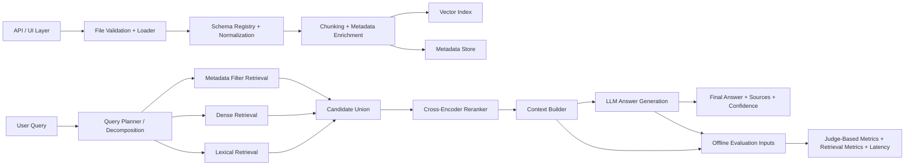

# Architecture Review

This file reviews the domain-specific RAG architecture used in the active codebase and keeps the system description aligned with the current implementation.

## What To Keep

- Explicit ingestion and validation
- Schema-aware loading for workbook data
- Hybrid retrieval instead of vector-only search
- A separate reranking stage
- Context building before answer generation
- Offline evaluation and observability

## What To Fix In The Diagram

1. `Streamlit` should be shown as an optional UI, not the core system entrypoint.
2. `SQL Query` should be renamed to `Metadata Filter Engine` unless you actually maintain a relational store.
3. `User Query Decomposition` should happen before retrieval and feed all retrieval branches.
4. `Reranker` should sit after candidate union from dense, lexical, and metadata retrieval.
5. The offline evaluation lane should be labeled `Judge-Based Metrics + Retrieval Metrics`, not `RAGAS`, because the current code uses custom LLM-judge prompts rather than the `ragas` Python API.
6. `Recall@K`, `MRR`, `latency`, and `correctness` are evaluation outputs, not part of the LLM box itself.
7. `Send Optimal Context` should be renamed to `Context Builder`, because this stage is doing selection, trimming, and diversity control.

## Corrected Target Architecture

## How This Maps To The Code

- Ingestion and normalization: `src/ev_llm_compare/excel_loader.py`
- Chunking and metadata enrichment: `src/ev_llm_compare/chunking.py`
- Query planning, metadata routing, hybrid retrieval, reranking, context selection: `src/ev_llm_compare/retrieval.py`
- Prompt building: `src/ev_llm_compare/prompts.py`
- Model execution: `src/ev_llm_compare/models.py`
- Orchestration: `src/ev_llm_compare/runner.py`
- Reference generation, evaluation metrics, and export: `src/ev_llm_compare/evaluation.py`

## Current Status

- Metadata-aware routing exists.
- Hybrid retrieval exists.
- Cross-encoder reranking exists with graceful fallback.
- Context building limits duplicate-company chunks.
- Structured summaries are capped so prompts do not explode.
- Offline evaluation exports a dedicated metrics workbook and per-question metrics sheet.

## Remaining Upgrade Path

- Add a true metadata DB if the domain expands beyond workbook-scale lookup.
- Add retrieval benchmarking datasets and per-query gold context labels.
- Add citation-aware answer formatting if the pipeline becomes user-facing.
- Add long-context compression or answer synthesis for very large grouped results.
